

<h1 align = "center">---[ Book Store Database ]---</h1>

 
 
<a href = "PostgreSQL">---[ PostgreSQL ]---</a> ■ 
<a href = "bds-project-assignment-1.pdf">---[ Documentation ]---</a> ■ 
<a href = "MySQL">---[ MySQL ]---</a>

<!--- details (dropdown) --->
<!--- ul (unordered list) --->
<!--- ol (ordered list) --->
<!--- li (list item) --->

 Table of contents 

<a href="#project-description">Project description</a> \
<a href="#diagrams">Diagrams</a> \
<a href="#table-descriptions">Table descriptions</a> \
<a href="#3rd-normal-form">3rd normal form</a> \
<a href="#functional-and-non-functional-requierments">Functional and non-functional requierments</a> \
<a href="#ddl-and-dml-scripts">DDL and DML scripts</a> \
<a href="#creation-evidence">Creation Evidence</a>

<!--- Project description --->
<!-- TODO: Add link to the documentation PDF. -->

 

## Project description
This is the the third project assignment for subject [BPC-BDS](https://www.vut.cz/studis/student.phtml?gm=gm_detail_predmetu&apid=268496) on BUT-FEEC with the goal to create a book store database with diagrams and structure in accordance to the assignment requirements, see [BDS Assignment 1](ProjectAssignment1-DatabaseDesign.pdf), more details found in [Project Documentation](bds-project-assignment-1.pdf).

[back to top](#project-description)

<!--- Diagrams --->

 

## Diagrams

### PostgreSQL ERD

### MySQL ERD

### Use Case Diagram

### System Context Diagram

[back to top](#project-description)

<!--- Table descriptions --->

 

## Table descriptions
---
### Book
> Keeps track of what books we have in the store.

<dl>
    <dt> book id
    <dd> Primary key of the entity, increases with more added tuples, serial datatype.
    <dt> title
    <dd> Title of the book, varchar datatype.
    <dt> isbn
    <dd> (International Standard Book Number) unique numeric book identifier, differs from book id to be used for commercial purposes, a varchar datatype.
    <dt> language id
    <dd> Foreign key referring to the book language entity, an int datatype.
    <dt> num pages
    <dd> Number of pages the book contains, an int datatype.
    <dt> publication date
    <dd> The date at which the book has been published, date datatype.
    <dt> publisher id
    <dd> Foreign key referring to the publisher entity, an int datatype.
</dl>

---
### Book language
> Keeps languages used by the books.

<dl>
    <dt> language id
    <dd> Primary key of the entity, increases with more added tuples, serial datatype.
    <dt> language code
    <dd> The code of the language it's printed in, a varchar datatype.
    <dt> language name
    <dd> The name of the language, a varchar datatype.
</dl>

---
### Author
> Holds data bout author names.

<dl>
    <dt> author id
    <dd> Primary key of the entity, increases with more added tuples, serial datatype.
    <dt> author name
    <dd> The name of the author, a varchar datatype.
</dl>

---
### Book author
> Relation between author and book entities, relates their IDs together.

<dl>
    <dt> book id
    <dd> Foreign key referring to the book entity, int datatype.
    <dt> author id
    <dd> Foreign key referring to the author entity, int datatype.
</dl>

---
### Publisher
> Tells the book's publisher.

<dl>
    <dt> publisher id
    <dd> Primary key of the entity, increases with more added tuples, serial datatype.
    <dt> publisher name
    <dd> Holds the name of publisher for the book, varchar datatype.
</dl>

---
### Order line
> Keeps track of order lines used in orders.

<dl>
    <dt> line id
    <dd> Primary key of the entity, increases with more added tuples, serial datatype.
    <dt> order id
    <dd> Foreign key referring to the customer order entity, int datatype.
    <dt> book id
    <dd> Foreign key referring to the book entity, int datatype.
    <dt> price
    <dd> The price of the book, float datatype.
</dl>

---
### Customer order
> Maintains customer's current orders.

<dl>
    <dt> order id
    <dd> Primary key of the entity, increases with more added tuples, serial datatype.
    <dt> ordered
    <dd> Timestamp at which the order was requested, Timestamp datatype.
    <dt> customer id
    <dd> Foreign key referring to the customer entity, int datatype.
    <dt> shipping method id
    <dd> Foreign key referring to the shipping method entity, int datatype.
    <dt> address id
    <dd> Holds on ID of the address where the order should be delivered to, int datatype.
    <dt> is ready for shipping
    <dd> Determines  if the order can be expedited, boolean datatype
</dl>

---
### Order history
> Keeps track of ongoing orders.

<dl>
    <dt> history id
    <dd> Primary key of the entity, increases with more added tuples, serial datatype.
    <dt> order id
    <dd> Foreign key referring to the customer order entity, int datatype.
    <dt> status id
    <dd> Foreign key referring to order status entity, int datatype.
    <dt> status date
    <dd> Date at which the order has been archived, date datatype.
</dl>

---
### Order status
>  Maintains states the ongoing order is in.

<dl>
    <dt> status id
    <dd> Primary key of the entity, increases with more added tuples, serial datatype.
    <dt> status value
    <dd> Name of the status the order is in, varchar datatype.
</dl>

---
### Country
> Holds a list of countries that was be ordered to.

<dl>
    <dt> country id
    <dd> Primary key of the entity, increases with more added tuples, serial datatype.
    <dt> country name
    <dd> Name of the country, varchar datatype.
</dl>

---
### Address
> Maintains a list of addresses ordered to by customers.

<dl>
    <dt> address id
    <dd> Primary key of the entity, increases with more added tuples, serial datatype.
    <dt> street number
    <dd> Street number, smallint datatype.
    <dt> street name
    <dd> Name of the street, varchar datatype.
    <dt> city
    <dd> Name of the city, varchar datatype.
    <dt> country id
    <dd> Foreign key referring to the country entity, varchar datatype.
</dl>

---
### Customer Address
> A relation between customer address and address status.

<dl>
    <dt> customer id
    <dd> Primary key of the entity, increases with more added tuples, serial datatype, refers to the customer entity.
    <dt> address id
    <dd> Foreign key referring to the address entity, int datatype.
    <dt> status id
    <dd> Foreign key referring to the address status entity, int datatype.
</dl>

---
### Address Status
> Maintains a list of states the address from the customer is in.

<dl>
    <dt> status id
    <dd> Primary key of the entity, increases with more added tuples, serial datatype.
    <dt> address status
    <dd> Name of the status, varchar datatype.
</dl>

---
### Shipping method
> A list of possible shipping methods.

<dl>
    <dt> method id
    <dd> Primary key of the entity, increases with more added tuples, serial datatype.
    <dt> method name
    <dd> Name of the shipping method, varchar datatype.
    <dt> cost
    <dd> Cost of the shipping method, float datatype.
</dl>

---
### Customer phone
> A list of phone numbers that can be optionally added to customer's profile.

<dl>
    <dt> phone id
    <dd> Primary key of the entity, increases with more added tuples, serial datatype.
    <dt> phone number
    <dd> The customer's phone number, varchar datatype.
    <dt> country id
    <dd> Foreign key referring to the country entity, int datatype.
</dl>

---
### Customer
> Keeps track of customer information.

<dl>
    <dt> customer id
    <dd> Primary key of the entity, increases with more added tuples, serial datatype.
    <dt> first name
    <dd> First name of the customer, varchar datatype.
    <dt> last name
    <dd> Last name of the customer, varchar datatype.
    <dt> password hash
    <dd> Hash of the customer's password varchar datatype.
    <dt> password salt
    <dd> Salt of the customer's password, varchar datatype.
    <dt> email
    <dd> E-mail of the customer, varchar datatype.
    <dt> phone id
    <dd> Foreign key referring to the customer phone entity, int datatype.
</dl>

---

[back to top](#project-description)

<!--- 3rd normal form --->

 

## 3rd normal form

The database was designed with 3rd normal for in mind in order to get rid of as many data anomalies and duplicates as possible, examples made in our database are the country, shipping method, order status, address status, author, publisher, and book language entities.

[back to top](#project-description)

<!--- Functional and non functional requirements --->

 

## Functional and non-functional requierments

### Functional

* The system sends to the customer information about their orders
* A search feature to make searching for books easier
* The system allows to give the user a demo to read before buying the book 

### Non-Functional

* The system should handle at least 250 thousand users without performance deterioration
* The website must load under 3 seconds simultaneously for less than 5 thousand users
* The website must be actively defended against DDoS attacks with proper policies and fending acting attackers at all costs.

[back to top](#project-description)

<!--- DDL & DML Scripts --->

 

## DDL and DML files

The Data Definition Language (DDL) and Data Modeling Language (DML) files were made in PostgreSQL and MySQL.

### PostgreSQL

Can be found in [PostgreSQL](PostgreSQL) Folder

| Name                                                | Description                                            |
| --------------------------------------------------- | ------------------------------------------------------ |
| [postgresql_DML.sql](PostgreSQL/postgresql_DML.sql) | Data modelling language file for a PostgreSQL database |
| [postgresql.DDL.sql](PostgreSQL/postgresql_DDL.sql) | Data definition language file for a PostreSQL database |

### MySQL

Can be found in [MySQL](MySQL) Folder
| Name                                 | Description                                        |
| ------------------------------------ | -------------------------------------------------- |
| [mySQL_DML.sql](MySQL/mySQL_DML.sql) | Data modelling language file for a MySQL database  |
| [mySQL_DDL.sql](MySQL/mySQL_DDL.sql) | Data definition language file for a MySQL database |

[back to top](#project-description)

## Creation Evidence

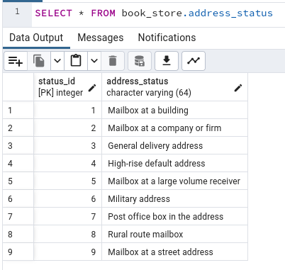
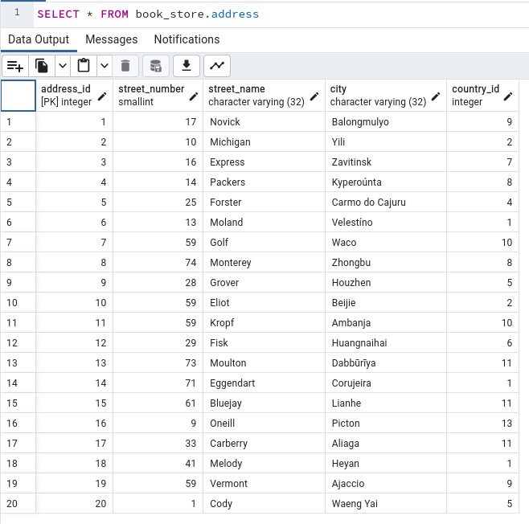
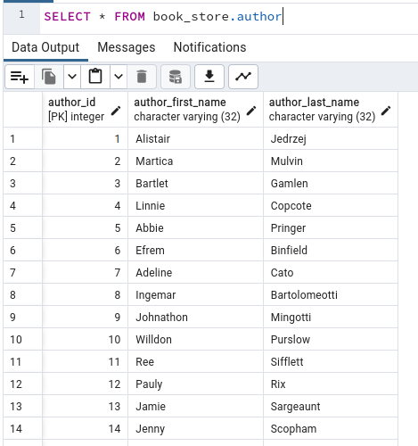
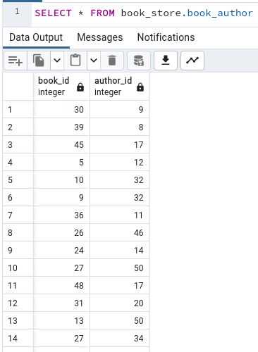
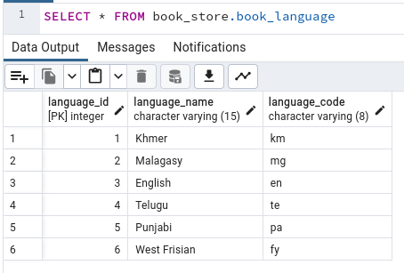
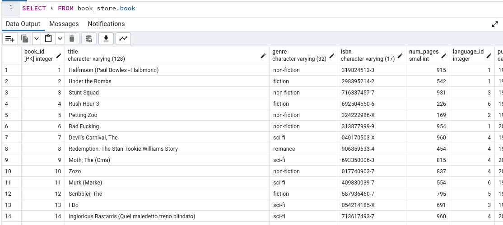
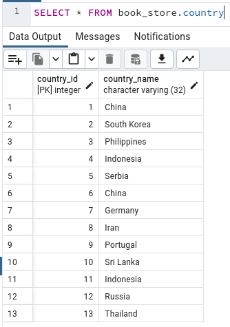
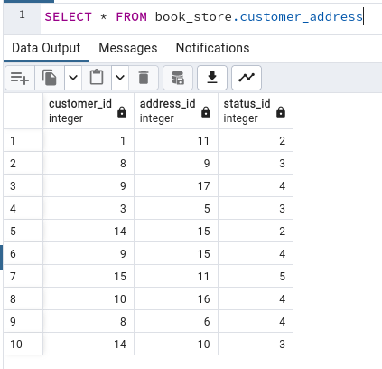
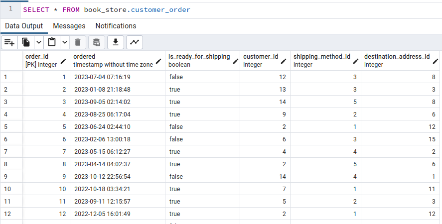
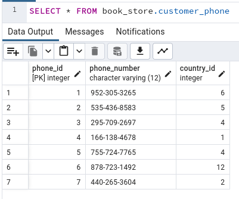
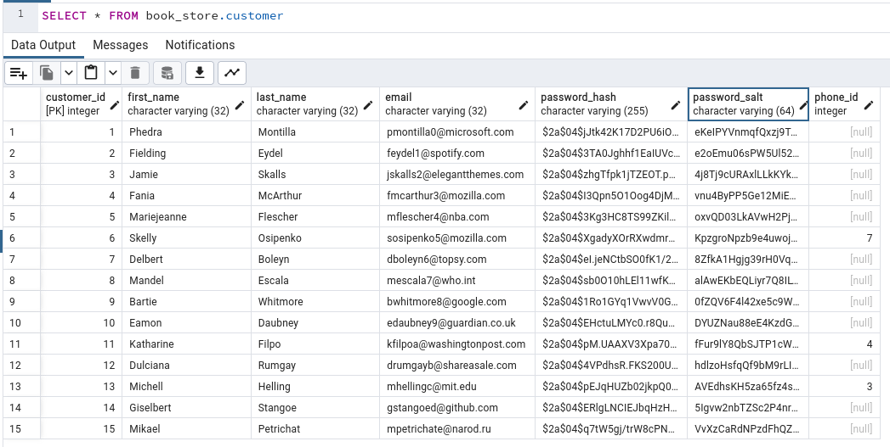
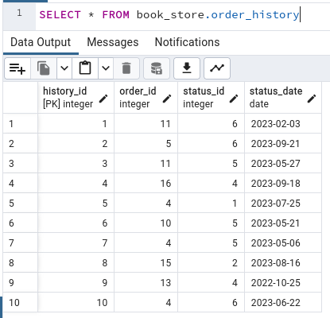
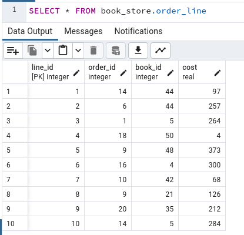
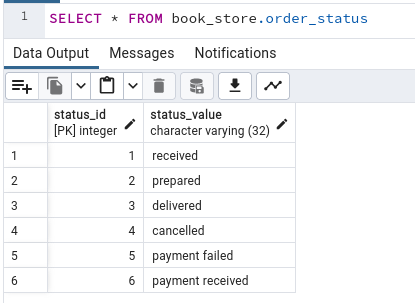
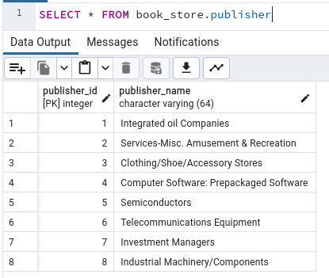
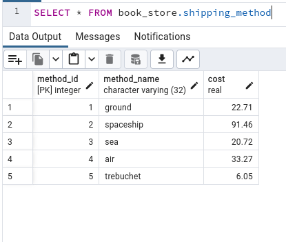

[back to top](#project-description)

